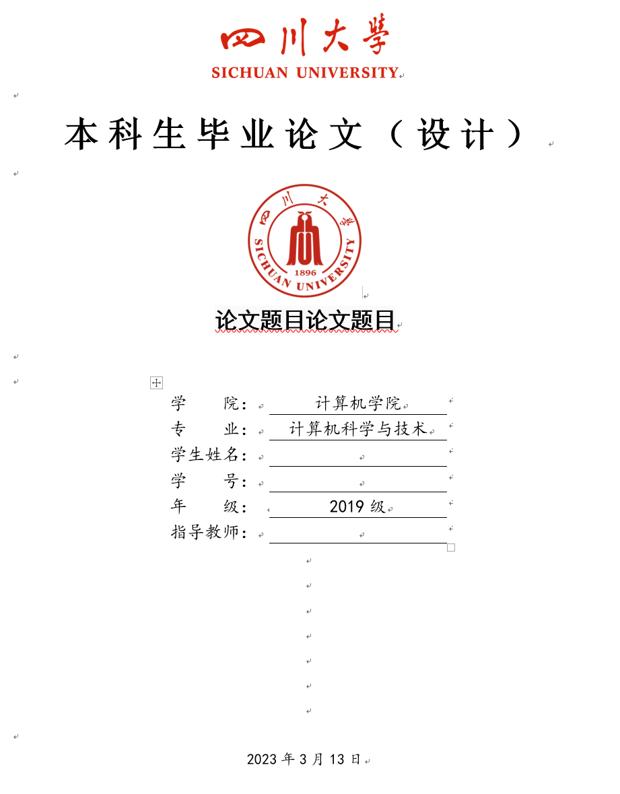
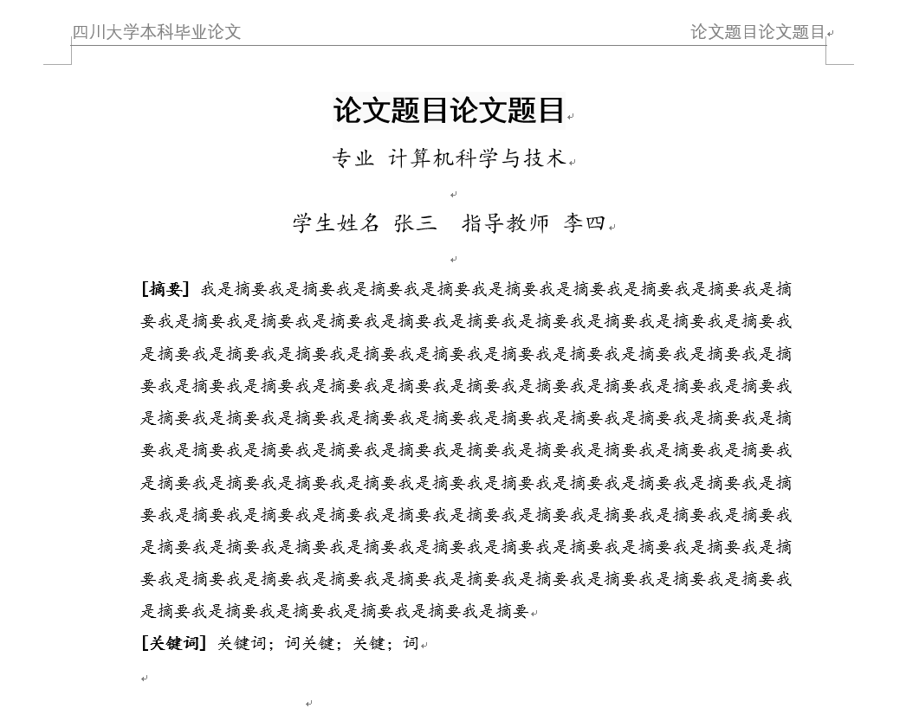
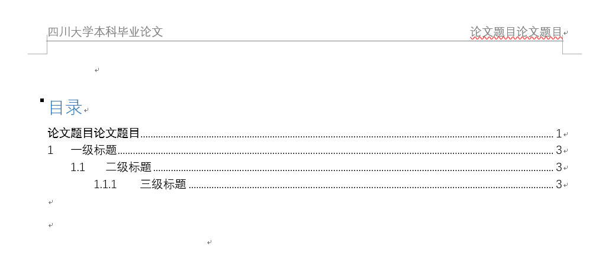
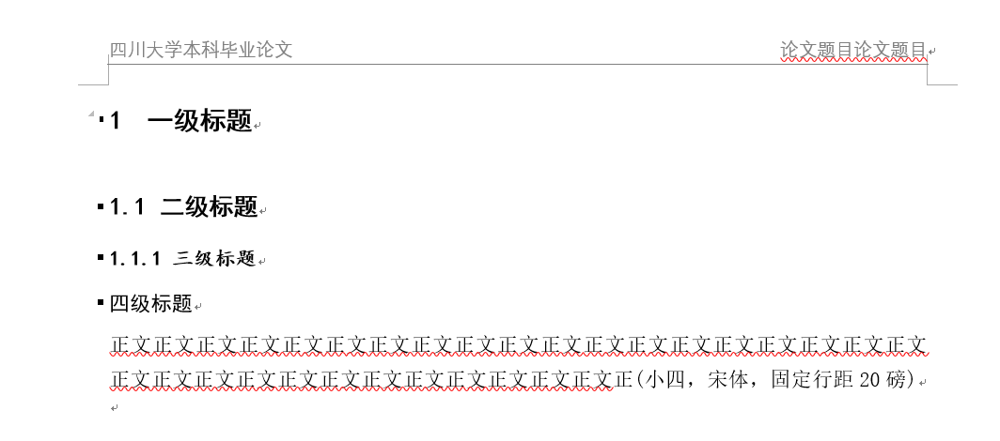

# 四川大学本科毕业论文 Word模板（scu-thesis-template）
## 仓库链接：
- github：[https://github.com/SunnyHaze/scu-thesis-template](https://github.com/SunnyHaze/scu-thesis-template) 
## 简介 
- 如题，本仓库中含有一个word模板，如果你不熟悉从github上下载，也可以使用如下的链接：
  - 百度网盘：[链接](https://pan.baidu.com/s/1BZYxLTkfT6kM6M5RG2QCmQ) 
  - 提取码：q4qg
- 此外，一位软件学院的帅哥学长还提供了一份软院教务老师制作的毕业论文指导模板，该模板偏向工程开发方向，有需要的同学也可以及时取用:
  - [四川大学本科毕业设计论文模板(软件学院).docx](四川大学本科毕业设计论文模板(软件学院).docx)
- 学校具体对于插入图片、引用、表格等等仍有具体的要求，可以参考官方的PDF内容进行撰写：
  - [附件：四川大学本科毕业论文（设计）管理办法（修订）-川大教【2022】56号](https://cs.scu.edu.cn/system/_content/download.jsp?urltype=news.DownloadAttachUrl&owner=1447926190&wbfileid=12054134)

## 展示
- 封面：
  

- 摘要：

- 目录：

- 正文

## 题外话
- 如果可以，给个star或者follow，分享给身边需要的人！ :) 非常非常感谢！！！
- 考虑到具体的插入图片的题注啊，多级列表的格式，以及参考文献的交叉引用等等操作还是比较复杂，确实不是很多同学都很熟悉，如果有需要的话可以提issue督促作者更新一个较为详细的写论文排版教程。
